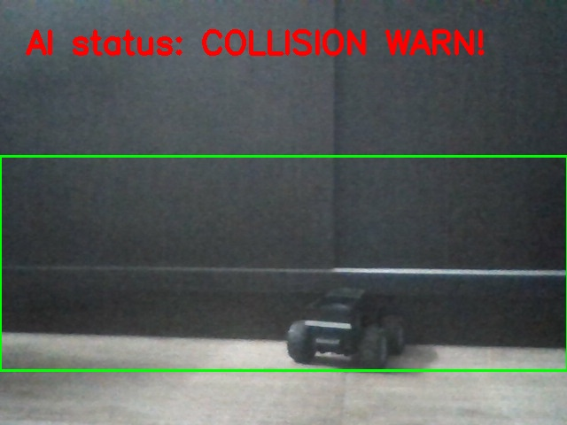
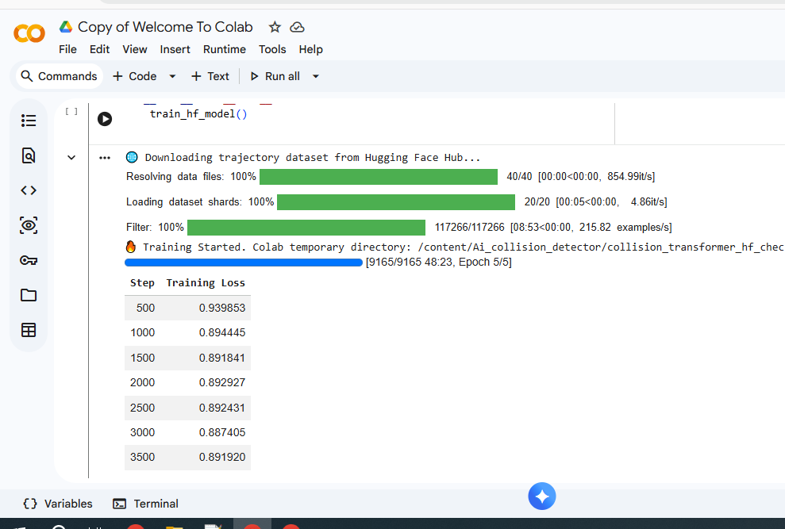

# Ai-collision-detector
This is a transformer based collsion detector which uses your available camera to map out evry onject and also detect any collsion between the objects and this ai model also uses cross layer loss entropy too.A stardance.hackclub project
To use and run the Ai model :Download the model weigths and downalod the run.py and add them in a single folder and run the run.py and make sure to have your camera available and have python and the neccesary liblaries to run the run.py .
```
   note:the hugging face space website in which my model is running the ouput and the input is in fast images and not fluid video becuase of gradio's restrictions but it would still work and detect as nromal evn if the output very slow and this mdoel is mean tto be a live detector not a image but can work somehow for fast images too .
```
 details of the traning wehn it was running in midway:
 [6998/9165 37:05 < 11:29, 3.14 it/s, Epoch 3.82/5]
```
Step	Training Loss
500	0.939853
1000	0.894445
1500	0.891841
2000	0.892927
2500	0.892431
3000	0.887405
3500	0.891920
4000	0.887372
4500	0.887480
5000	0.889427
5500	0.886629
6000	0.888934
6500	0.885127
details of the final trnaing result:
Step	Training Loss
500	0.939853
1000	0.894445
1500	0.891841
2000	0.892927
2500	0.892431
3000	0.887405
3500	0.891920
4000	0.887372
4500	0.887480
5000	0.889427
5500	0.886629
6000	0.888934
6500	0.885127
7000	0.884050
7500	0.889465
8000	0.887719
8500	0.884226
9000	0.887376 #final outcome 
```
---
To use and run the model on your device :
Donwload or clone this repostory 
Run or click on the file named run.py and then test it out.
You can also tweak the model to just outline the onjects only or for any use .

example use case:accident detectors ,collision detectors and etc.





----





It took approximatly 46mins to train the model on 5 epochs.
